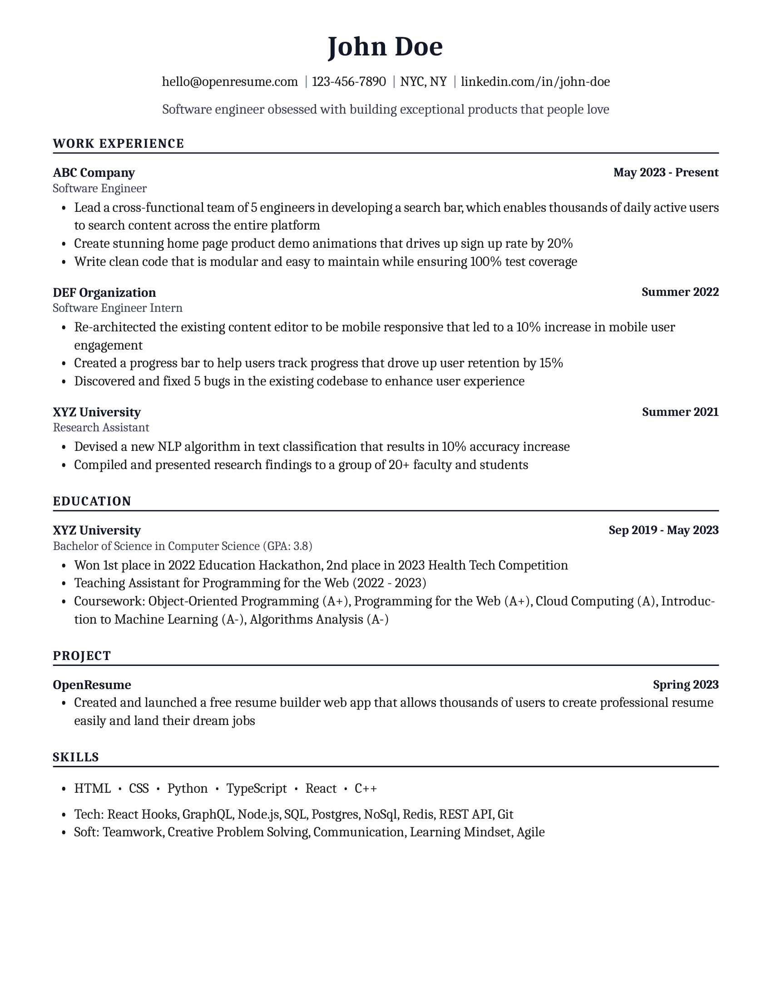
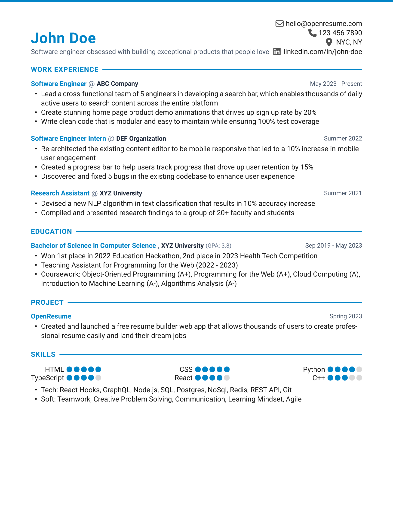
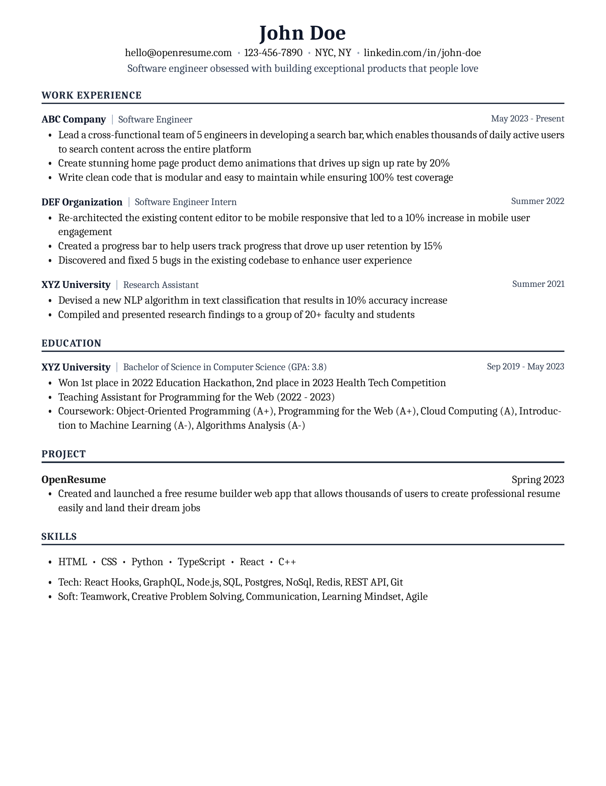
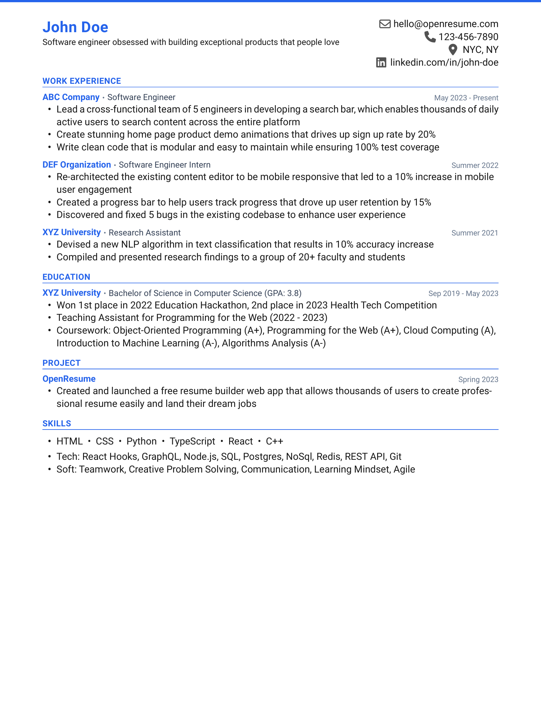
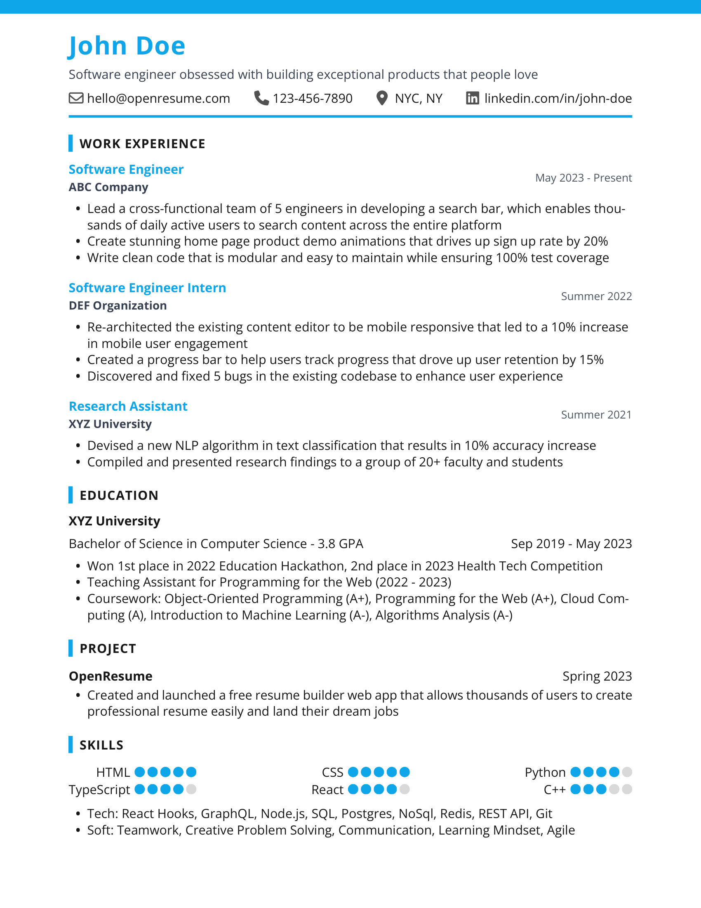
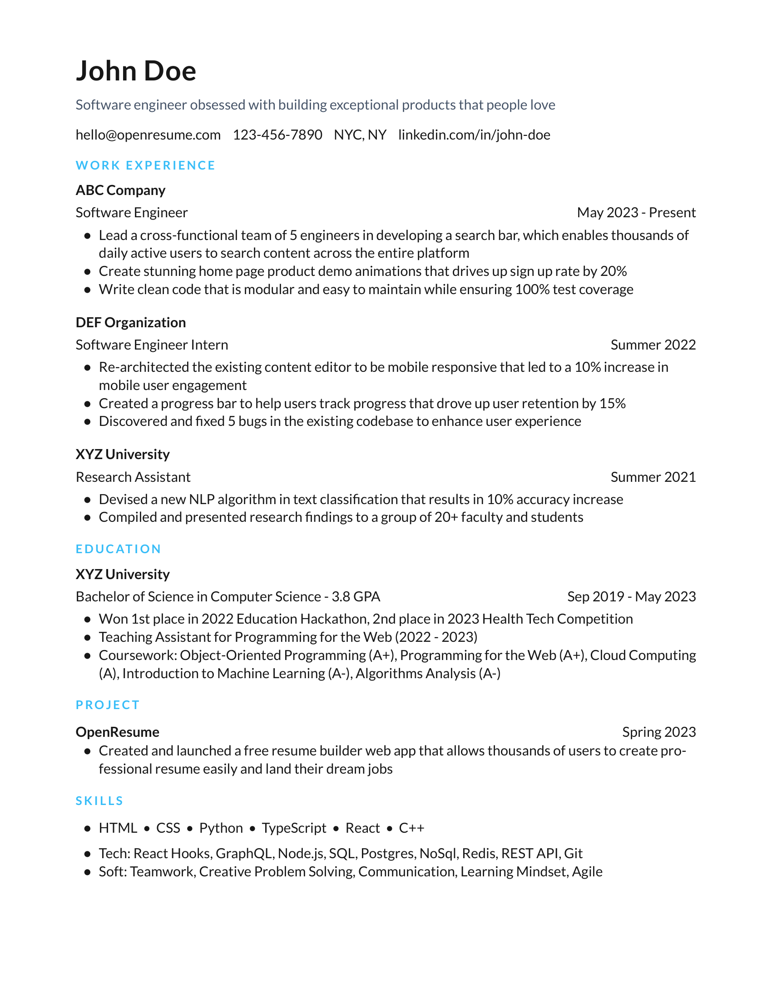
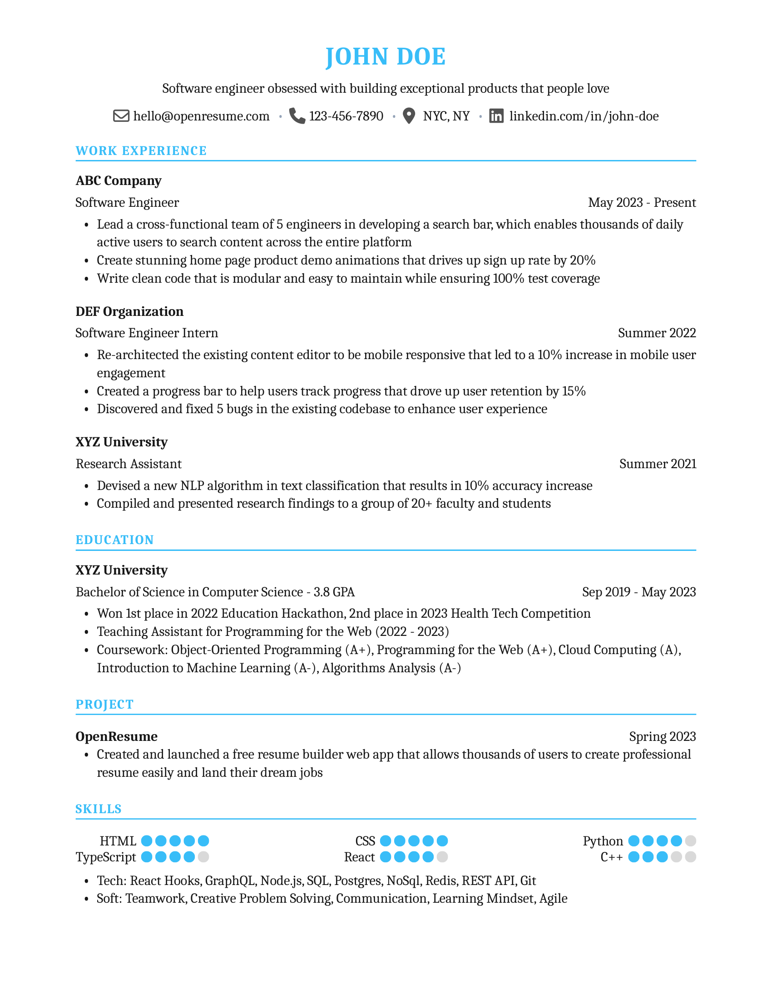
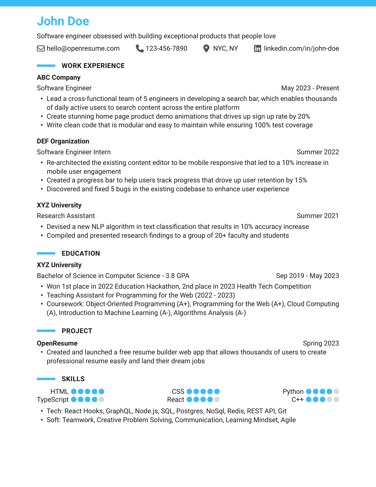

# OpenResume

OpenResume is a powerful open-source resume builder and resume parser.

The goal of OpenResume is to provide everyone with free access to a modern professional resume design and enable anyone to apply for jobs with confidence.

Official site: [https://open-resume.com](https://open-resume.com)

## Resume Builder

OpenResume's resume builder allows user to create a modern professional resume easily.


It has 6 Core Features:
| <div style="width:285px">**Feature**</div> | **Description** |
|---|---|
| **1. Real Time UI Update** | The resume PDF is updated in real time as you enter your resume information, so you can easily see the final output. |
| **2. Multi-Template Selection** | Choose across 8 curated ATS-friendly resume templates including iconic LaTeX styles: **Jake's LaTeX** (Overleaf CS gold standard with `\hrulefill`), **ModernCV LaTeX** (European academic & tech standard with rule accents), **Tech LaTeX** (high-density FAANG engineering layout), **Modern** (sleek colored accents), **Classic** (traditional corporate centered header), **Executive** (bold header line & solid accents), **Minimal** (clean Swiss typography), and **Compact** (dense 1-page space saver). |
| **3. Modern Professional Resume Design** | The resume PDF is a modern professional design that adheres to U.S. best practices and is ATS friendly to top ATS platforms such as Greenhouse and Lever. It automatically formats fonts, sizes, margins, bullet points to ensure consistency and avoid human errors. |
| **4. Privacy Focus** | The app only runs locally on your browser, meaning no sign up is required and no data ever leaves your browser, so it gives you peace of mind on your personal data. (Fun fact: Running only locally means the app still works even if you disconnect the internet.) |
| **5. Import From Existing Resume PDF / JSON** | If you already have an existing resume PDF or an AI-generated `resume.json`, you can import it directly into OpenResume in seconds. |
| **6. Successful Track Record** | OpenResume users have landed interviews and offers from top companies, such as Dropbox, Google, Meta to name a few. It has been proven to work and liken by recruiters and hiring managers. |

## Resume Template Gallery

OpenResume includes 8 distinct, ATS-optimized templates. Every template is fully customizable in font family, font size, theme color, document size (Letter/A4), and section order.

| **Jake's LaTeX (`latex-jakes`)** | **ModernCV LaTeX (`latex-moderncv`)** |
| :---: | :---: |
|  |  |
| *Overleaf CS Gold Standard with `\hrulefill` dividers* | *European Academic & Tech style with horizontal rule accents* |

| **Tech LaTeX (`latex-sb2nov`)** | **Compact (`compact`)** |
| :---: | :---: |
|  |  |
| *Silicon Valley FAANG high-density engineering layout* | *Space-saving 2-column header & dense single-page flow* |

| **Executive (`executive`)** | **Minimal (`minimal`)** |
| :---: | :---: |
|  |  |
| *Bold header band & solid vertical accent bars* | *Swiss typography with wide tracking & airy whitespace* |

| **Classic (`classic`)** | **Modern (`modern`)** |
| :---: | :---: |
|  |  |
| *Traditional corporate centered header & underline dividers* | *OpenResume original with top accent bar & badge markers* |

## Resume Parser

OpenResume’s second component is the resume parser. For those who have an existing resume, the resume parser can help test and confirm its ATS readability.


You can learn more about the resume parser algorithm in the ["Resume Parser Algorithm Deep Dive" section](https://open-resume.com/resume-parser).

## Tech Stack

| <div style="width:140px">**Category**</div> | <div style="width:100px">**Choice**</div> | **Descriptions** |
|---|---|---|
| **Language** | [TypeScript](https://github.com/microsoft/TypeScript) | TypeScript is JavaScript with static type checking and helps catch many silly bugs at code time. |
| **UI Library** | [React](https://github.com/facebook/react) | React’s declarative syntax and component-based architecture make it simple to develop reactive reusable components. |
| **State Management** | [Redux Toolkit](https://github.com/reduxjs/redux-toolkit) | Redux toolkit reduces the boilerplate to set up and update a central redux store, which is used in managing the complex resume state. |
| **CSS Framework** | [Tailwind CSS](https://github.com/tailwindlabs/tailwindcss) | Tailwind speeds up development by providing helpful css utilities and removing the need to context switch between tsx and css files. |
| **Web Framework** | [NextJS 13](https://github.com/vercel/next.js) | Next.js supports static site generation and helps build efficient React webpages that support SEO. |
| **PDF Reader** | [PDF.js](https://github.com/mozilla/pdf.js) | PDF.js reads content from PDF files and is used by the resume parser at its first step to read a resume PDF’s content. |
| **PDF Renderer** | [React-pdf](https://github.com/diegomura/react-pdf) | React-pdf creates PDF files and is used by the resume builder to create a downloadable PDF file. |

## Project Structure

OpenResume is created with the NextJS web framework and follows its project structure. The source code can be found in `src/app`. There are a total of 4 page routes as shown in the table below. (Code path is relative to `src/app`)

| <div style="width:115px">**Page Route**</div> | **Code Path** | **Description** |
|---|---|---|
| / | /page.tsx | Home page that contains hero, auto typing resume, steps, testimonials, logo cloud, etc |
| /resume-import | /resume-import/page.tsx | Resume import page, where you can choose to import data from an existing resume PDF. The main component used is `ResumeDropzone` (`/components/ResumeDropzone.tsx`) |
| /resume-builder | /resume-builder/page.tsx | Resume builder page to build and download a resume PDF. The main components used are `ResumeForm` (`/components/ResumeForm`) and `Resume` (`/components/Resume`) |
| /resume-parser | /resume-parser/page.tsx | Resume parser page to test a resume’s AST readability. The main library util used is `parseResumeFromPdf` (`/lib/parse-resume-from-pdf`) |

### Method 1: npm

1. Download the repo `git clone https://github.com/xitanggg/open-resume.git`
2. Change the directory `cd open-resume`
3. Install dependencies `npm install`
4. Start development server `npm run dev`
5. Run automated test suite `npm test` (or `npm run test:watch` for interactive watch mode)
6. Open your browser and visit [http://localhost:3000](http://localhost:3000) to see OpenResume live

### Method 2: Docker

1. Download the repo `git clone https://github.com/xitanggg/open-resume.git`
2. Change the directory `cd open-resume`
3. Build the container `docker build -t open-resume .`
4. Start the container `docker run -p 3000:3000 open-resume`
5. Open your browser and visit [http://localhost:3000](http://localhost:3000) to see OpenResume live

## Performance and Architecture Highlights

- **Zero-Latency Typing**: State persistence to `localStorage` is debounced (500ms) with an automatic `beforeunload` flush, preventing main-thread blocking during rapid typing.
- **Efficient PDF Compilation**: PDF document generation via `@react-pdf/renderer` is debounced to avoid CPU thrashing on continuous keystrokes, with visual download preparation states.
- **Memoized ATS Parser Pipeline**: Text extraction, line grouping, and section scoring in the Resume Parser Playground are fully memoized using `useMemo` to eliminate redundant recalculations across UI updates.
- **Resource and Memory Safety**: Automatic revocation of browser `blob:` object URLs upon file removal and unmount prevents memory leaks during heavy PDF uploads.
- **Optimized Window Listeners**: Centralized, animation-frame-throttled resize listeners for dynamic autosizing inputs replace dozens of individual global event listeners.

## Local AI Agent Integration (AGY, Kimi, Cursor, Claude, Ollama)

OpenResume supports direct integration with local coding agents and LLMs (such as **Antigravity / AGY**, **Kimi**, **Cursor**, **Claude Code**, or local **Ollama** models) to build, tailor, and format resumes locally with zero data ever sent to third-party resume platforms.

### 1. How It Works
AI agents can generate an OpenResume-compliant `resume.json` file. You can simply drag and drop the `.json` file into `/resume-import` (or browser dropzone), and OpenResume will immediately render your fully editable resume with your selected template.

### 2. AI Agent Prompt Template

Copy and pass this instruction to your AI agent (AGY, Kimi, etc.):

```markdown
You are an expert resume writer and ATS optimization specialist.
Generate a structured resume JSON for the candidate tailored to the target job description.
Return ONLY valid JSON matching this schema:

{
  "resume": {
    "profile": {
      "name": "Jane Doe",
      "summary": "Full Stack Engineer with 6+ years building scalable distributed systems...",
      "email": "jane.doe@example.com",
      "phone": "+1 (555) 019-2834",
      "location": "San Francisco, CA",
      "url": "https://linkedin.com/in/janedoe"
    },
    "workExperiences": [
      {
        "company": "Acme Corp",
        "jobTitle": "Senior Software Engineer",
        "date": "2021 - Present",
        "descriptions": [
          "Architected real-time event streaming pipeline processing 10M+ events/day using Kafka and Go",
          "Reduced p99 API latency by 45% through query optimization and Redis caching layer"
        ]
      }
    ],
    "educations": [
      {
        "school": "University of California, Berkeley",
        "degree": "B.S. in Computer Science",
        "date": "2015 - 2019",
        "gpa": "3.85",
        "descriptions": ["Dean's Honor List, Magna Cum Laude"]
      }
    ],
    "projects": [
      {
        "project": "OpenSource Tool",
        "date": "2023",
        "descriptions": ["Built CLI developer tool with 2k+ GitHub stars using TypeScript and Rust"]
      }
    ],
    "skills": {
      "featuredSkills": [
        { "skill": "TypeScript", "rating": 5 },
        { "skill": "React / Next.js", "rating": 5 },
        { "skill": "Go / Python", "rating": 4 },
        { "skill": "PostgreSQL", "rating": 4 },
        { "skill": "Kubernetes", "rating": 4 },
        { "skill": "GraphQL", "rating": 4 }
      ],
      "descriptions": [
        "Languages & Frameworks: TypeScript, JavaScript, Python, Go, React, Next.js, Node.js",
        "Cloud & DevOps: AWS, Docker, Kubernetes, Terraform, GitHub Actions, CI/CD"
      ]
    },
    "custom": {
      "descriptions": []
    }
  },
  "settings": {
    "template": "modern",
    "themeColor": "#38bdf8",
    "fontFamily": "Roboto",
    "fontSize": "11",
    "documentSize": "Letter"
  }
}
```

### 3. Template Options for AI Agents

When specifying `settings.template`, agents can pick any of the 8 built-in styles:
- `"latex-jakes"`: Iconic Overleaf CS gold standard with centered header and `\hrulefill` dividers
- `"latex-moderncv"`: Classic European academic & tech LaTeX style with horizontal rule accents
- `"latex-sb2nov"`: High-density Silicon Valley / FAANG engineering standard
- `"modern"`: Sleek colored accents and section marker bars
- `"classic"`: Traditional corporate centered header with full-width dividers
- `"executive"`: Bold header line with solid vertical accent bars
- `"minimal"`: Clean Swiss typography with tracked uppercase headings and airy margins
- `"compact"`: Dense single-page layout for maximizing space on tech resumes

### 4. Direct Browser Injection (Optional)
If running automated scripts or browser sidecars, agents can inject the state directly into the browser session:
```javascript
localStorage.setItem("open-resume-state", JSON.stringify({ resume, settings }));
window.location.href = "/resume-builder";
```


